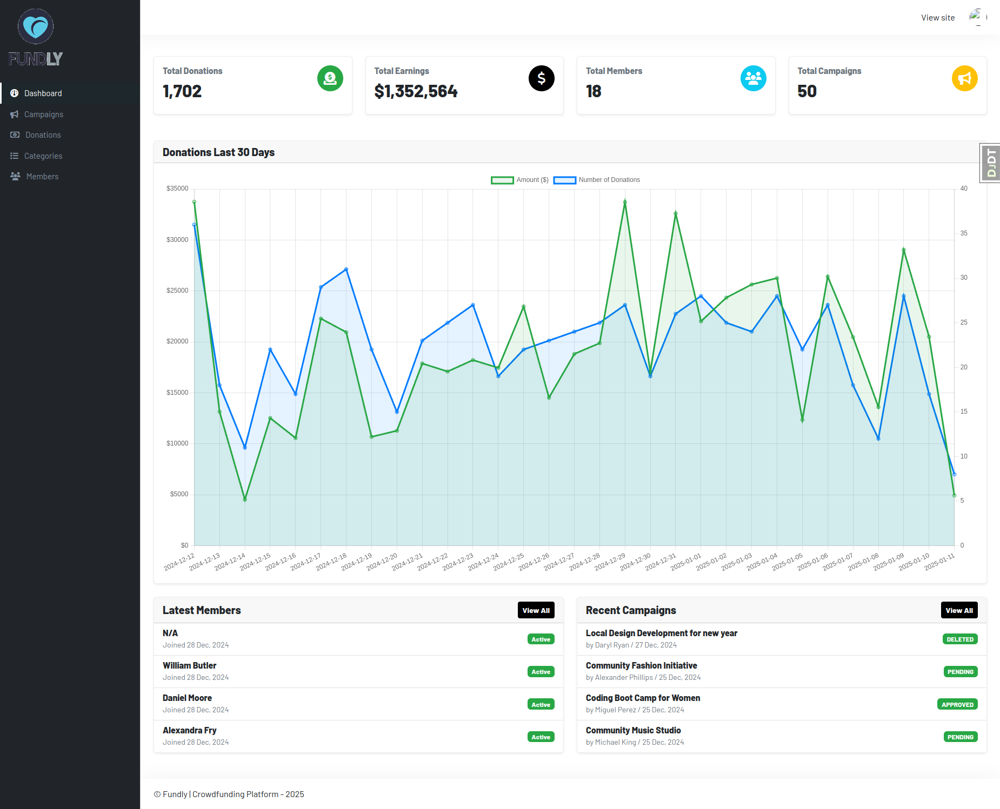
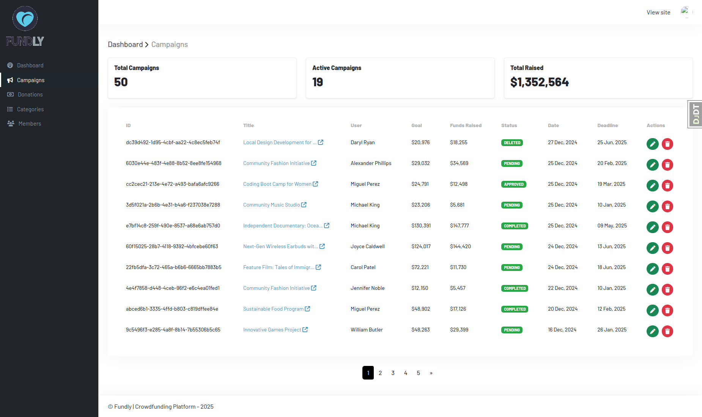

# Fundly - Crowdfunding Platform

A modern crowdfunding platform built with Django that enables users to create and manage fundraising campaigns for various causes.

## Features

### User Management
- User registration and authentication
- Profile management with avatar support
- Password change functionality
- Account settings customization

### Campaign Management
- Create and manage fundraising campaigns
- Rich text editor for campaign descriptions
- Campaign categorization
- Campaign status tracking (active, pending, completed)
- Campaign progress tracking
- Image upload support
- Campaign sharing functionality

### Donation System
- Secure donation processing
- Anonymous donation option
- Multiple payment gateway support
- Donation tracking and statistics
- Minimum donation validation
- Donation comments

### Dashboard
- User campaign dashboard
- Campaign statistics
- Donation history
- Campaign performance metrics

### Search & Discovery
- Category-based browsing
- Search functionality
- Featured campaigns
- Recent campaigns showcase
- Campaign filtering

### Additional Features
- Responsive design
- Social media sharing
- Email notifications
- Campaign embedding
- Progress tracking
- Real-time statistics

### Screenshots


*Home page*


*Campaign page*


*Donation page*


*Charts page*


*Admin dashboard page*


*Admin campaigns page*

## Tech Stack

### Backend
- Python 3.x
- Django 4.x
- PostgreSQL
- Django REST Framework

### Frontend
- HTML5
- CSS3
- JavaScript
- Bootstrap 4
- jQuery
- Font Awesome
- TinyMCE Editor

### Additional Tools
- Pillow for image processing
- Django Humanize
- Django Crispy Forms
- Python Decouple
- Django Debug Toolbar

## Installation

1. Clone the repository
```bash
git clone https://github.com/yourusername/fundly.git
cd fundly
```

2. Create a virtual environment
```bash
python -m venv venv
source venv/bin/activate # On Windows use: venv\Scripts\activate
```

3. Install dependencies
```bash
pip install -r requirements.txt
```

4. Run migrations
```bash
python manage.py migrate
```

5. Create a superuser
```bash
python manage.py createsuperuser
```

6. Generate sample data (optional)
```bash
python manage.py generate_sample_data
```

7. Run the development server
```bash
python manage.py runserver
```

## Contributing

1. Fork the repository
2. Create a new branch (`git checkout -b feature/improvement`)
3. Make your changes
4. Commit your changes (`git commit -am 'Add new feature'`)
5. Push to the branch (`git push origin feature/improvement`)
6. Create a Pull Request

## License

This project is licensed under the MIT License - see the [LICENSE](LICENSE) file for details.

## Acknowledgments

- Bootstrap for the frontend framework
- Django for the amazing web framework
- All contributors who have helped with the project

Built with ❤️ for better healthcare access

